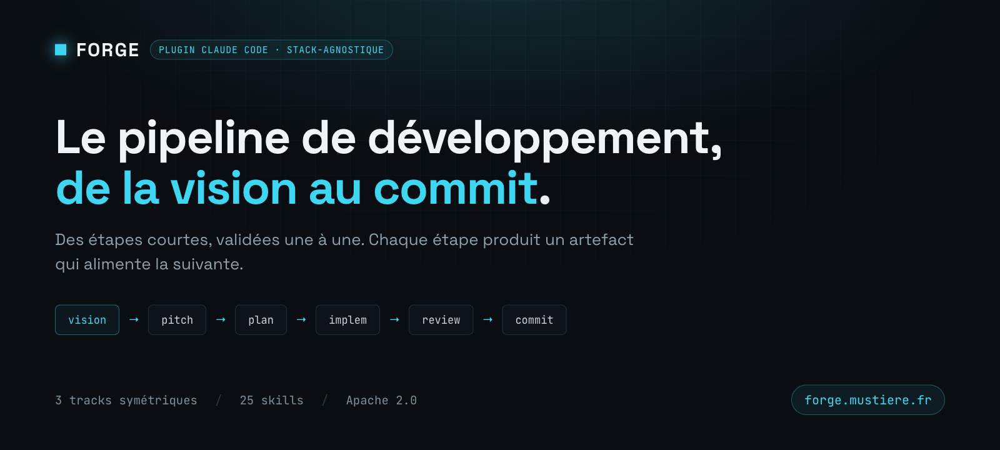

**Forge** est une marketplace de plugins Claude Code. Elle publie un plugin : `forge`, un pipeline de développement stack-agnostique qui pilote tout le cycle — de la vision projet jusqu'au commit — en étapes courtes, validées une à une.

**📖 Documentation complète : [forge.mustiere.fr](https://forge.mustiere.fr)** — pipeline, tracks, référence des skills, configuration et dépannage.

## Installation

Dans une session Claude Code, sur n'importe quel projet :

```
/plugin marketplace add gabrielmustiere/forge
/plugin install forge@forge
/reload-plugins
```

Les skills sont namespacées par le nom du plugin : `/forge:help`, `/forge:feature-pitch`, etc.

Mettre à jour : `/plugin marketplace update forge` puis `/reload-plugins`.

Une fois installé, `/forge:help` est le GPS du pipeline. La documentation détaillée vit sur [forge.mustiere.fr/docs](https://forge.mustiere.fr/docs/).

## Ce que contient ce dépôt

| Chemin | Rôle |
| --- | --- |
| `plugins/forge/` | Le plugin et ses skills — inventaire : [`SKILLS.md`](plugins/forge/SKILLS.md) |
| `.claude-plugin/marketplace.json` | Le catalogue de la marketplace |
| `site/` | Le site publié sur [forge.mustiere.fr](https://forge.mustiere.fr) (GitHub Pages) |
| `src/`, `config/`, `templates/`… | **Forge Board**, l'application Symfony — voir plus bas |

> Les skills Symfony, Sylius et éditoriales vivent dans une marketplace séparée : [`gabrielmustiere/skills`](https://github.com/gabrielmustiere/skills).

Pour tester une modification du plugin avant publication : `claude --plugin-dir <chemin>/plugins/forge`, puis `/reload-plugins` après chaque modification.

---

# Forge Board — l'application

**Forge Board** est l'application Symfony hébergée à la **racine de ce dépôt**. C'est un tableau kanban **lecture seule** qui scanne les documents produits par le workflow forge (`docs/story/NNN-<f|r|t>-<slug>/`) et projette chaque story en carte le long d'un pipeline visuel — pour répondre en quelques secondes à « où en est le projet X ? ». Vision complète : [`docs/vision.md`](docs/vision.md). Stack détaillée : [`docs/stack.md`](docs/stack.md).

> L'app et la marketplace cohabitent dans le même repo : les fichiers Symfony sont à la racine, la marketplace vit sous `plugins/`.

## Stack

- **Framework** : Symfony 8.0 / PHP 8.5+ — serveur local via Symfony CLI (proxy HTTPS `*.wip`)
- **Base de données** : SQLite (fichier local, zéro infra)
- **Design system** : « Nova · Midnight » (voir [`DESIGN.md`](DESIGN.md)) — thème sombre dense inspiré de Linear, accent iris. Tokens dans `assets/styles/app.css`
- **Front** : Tailwind CSS 4, Flowbite 4, Symfony UX (Stimulus, Icons, Live Component, Turbo, Toolkit) + AssetMapper
- **Tests** : PHPUnit 13 (Unit + Functional) + Playwright (E2E)
- **Qualité** : PHPStan level 9 + PHP-CS-Fixer
- **Async** : Symfony Messenger (transport Doctrine)
- **E-mails (dev)** : Mailpit

## Prérequis

- [PHP 8.5+](https://www.php.net/), [Composer](https://getcomposer.org/), [Symfony CLI](https://symfony.com/download)
- [Docker](https://www.docker.com/) (uniquement pour Mailpit)
- [Node.js 22+](https://nodejs.org/) (Playwright et Tailwind)

## Démarrer

```bash
make init              # Installation complète (deps PHP/JS + DB + fixtures)
docker compose up -d   # Mailpit (capture des e-mails)
make serve             # Serveur Symfony
```

L'application est accessible sur `https://forge-board.wip` (domaine configurable dans `.symfony.local.yaml` et `.env`).

## Workflow Makefile

| Commande          | Description                                                |
|-------------------|------------------------------------------------------------|
| `make init`       | Installation complète (deps + DB + fixtures)               |
| `make serve`      | Lance le serveur Symfony (arrière-plan)                    |
| `make stop`       | Arrête le serveur Symfony                                  |
| `make db-reset`   | Recrée la base from scratch (drop + migrate + fixtures)    |
| `make migration`  | Génère une migration depuis le diff d'entités              |
| `make phpunit`    | Tests PHPUnit (Unit + Functional)                          |
| `make playwright` | Tests E2E Playwright                                       |
| `make quality`    | CS-Fixer + PHPStan + build                                 |
| `make ci`         | Lint + tests unitaires                                     |

`make help` liste toutes les cibles.

La QA de l'application tourne **en local** : la seule intégration continue du dépôt (`.github/workflows/pages.yml`) vérifie et déploie le site.

## Accès aux services

- **Application** : `https://forge-board.wip`
- **Mailpit (UI web)** : http://localhost:8027
- **Base SQLite (dev)** : `var/data.db` (via `sqlite3 var/data.db`)
- **Identifiants de test** : `admin@example.com` / `password`

## Serveurs MCP (Claude Code)

`.mcp.json` configure trois serveurs MCP pour l'assistance IA : **symfony-ai-mate** (profiler, logs, container), **playwright** (automatisation navigateur), **chrome-devtools**.

## Licence

Marketplace `forge` et application Forge Board distribuées sous licence [Apache 2.0](LICENSE). © 2026 Gabriel Mustiere.
