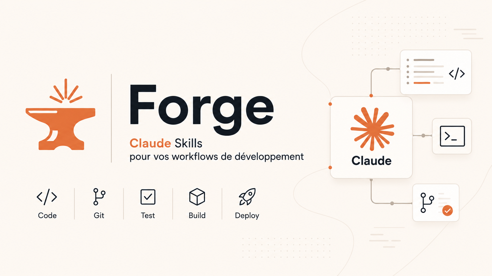

**Forge** est une marketplace de plugins Claude Code. Elle publie un plugin : `workflow`, un pipeline de développement stack-agnostique qui pilote tout le cycle — de la vision projet jusqu'au commit — en étapes courtes, validées une à une.

- **Marketplace** : `forge`
- **Source** : `gabrielmustiere/forge`

> Les skills Symfony, Sylius et éditoriales vivent dans une marketplace séparée : [`gabrielmustiere/skills`](https://github.com/gabrielmustiere/skills).

## Installation

Dans une session Claude Code, sur n'importe quel projet :

```
/plugin marketplace add gabrielmustiere/forge
/plugin install workflow@forge
/reload-plugins
```

Les skills sont namespacées par le nom du plugin : `/workflow:help`, `/workflow:feature-pitch`, etc.

Mettre à jour : `/plugin marketplace update forge` puis `/reload-plugins`.

## Principe

Chaque étape produit un artefact markdown (`pitch.md`, `plan.md`, `review.md`, `report.md`) qui alimente la suivante. **On ne passe jamais à l'étape d'après sans validation explicite** (`ok`, `go`, `validé`). Trois tracks symétriques selon la nature du changement, un même pipeline.

```
PHASE 0 (une fois, documents vivants)
  vision           → docs/vision.md            (problème, audience, North Star)
  product-backlog  → docs/product-backlog.md   (domaines, capacités, MVP/V2/V3)
  stack            → docs/stack.md             (langages, infra, CI — phase 0 technique)

TRACK selon le changement
  Feature (user-facing)        : (feature-interview) → feature-pitch → feature-plan → feature-implem
  Refacto (comportement figé)  : refactor-plan → refactor-implem
  Tech (perf/sécu/observabilité) : tech-plan → tech-implem

CLÔTURE (commune aux 3 tracks)
  review → commit → report → sync
```

Tout vit dans `docs/story/NNN-<f|r|t>-<slug>/` — compteur global, donc le tri lexicographique donne la timeline du projet. Exemple : `docs/story/042-f-checkout-express/`.

Perdu en cours de route ? `/workflow:help` est le GPS du pipeline.

## Skills

### Phase 0 — Poser le décor (documents vivants, 4 modes : Création / Enrichir / Éditer / Pivot)

| Skill | Rôle |
| --- | --- |
| `/workflow:vision` | Cadre la vision : problème, audience, valeur, North Star, principes, anti-objectifs → `docs/vision.md` |
| `/workflow:product-backlog` | Traduit la vision en domaines, capacités, parcours et backlog priorisé MVP/V2/V3 → `docs/product-backlog.md` |
| `/workflow:stack` | Cartographie la stack technique (langages, backend, frontend, données, ops, CI) → `docs/stack.md`. Chaque techno prouvée par un fichier source |

### Track feature — Valeur utilisateur

| Skill | Rôle |
| --- | --- |
| `/workflow:feature-interview` | *(optionnel, amont)* Découvre un besoin flou par interview guidée, ancrée sur le code existant → `brief.md` (alimente `feature-pitch`) |
| `/workflow:feature-pitch` | Cadre l'idée et challenge l'alignement (vision/backlog) → `pitch.md` |
| `/workflow:feature-plan` | Plan technique : archi, données, contrats, migration, tests → `plan.md` |
| `/workflow:feature-implem` | Implémentation guidée sous-tâche par sous-tâche, QA continue |

### Track refacto — Comportement figé, code restructuré

| Skill | Rôle |
| --- | --- |
| `/workflow:refactor-plan` | Cadrage + tests de caractérisation à poser comme verrou → `plan.md` |
| `/workflow:refactor-implem` | Exécution verrou-tests-d'abord, étapes incrémentales réversibles |

### Track tech — Perf, résilience, observabilité, sécu (non user-facing)

| Skill | Rôle |
| --- | --- |
| `/workflow:tech-plan` | Cadrage avec métrique cible chiffrée + baseline + kill switch → `plan.md` |
| `/workflow:tech-implem` | Exécution : baseline, kill switch, mesure après chaque étape |

### Clôture — Commune aux trois tracks

| Skill | Rôle |
| --- | --- |
| `/workflow:review` | Code review du diff : sécu, qualité, conformité au plan, non-régression → `review.md` |
| `/workflow:commit` | Message Conventional Commits en français (l'intention), commit + push |
| `/workflow:report` | Compte rendu honnête : ce qui a été fait vs prévu, écarts, dettes → `report.md` |
| `/workflow:sync` | Réaligne `pitch.md` / `plan.md` sur le code livré, avec changelog |

### Utilitaires (hors pipeline)

| Skill | Rôle |
| --- | --- |
| `/workflow:help` | Sommaire du pipeline, tracks, skills et artifacts |
| `/workflow:claude-md` | Génère ou met à jour le `CLAUDE.md` à la racine : analyse du codebase (prouvée par fichier) + principes comportementaux Karpathy. Réutilise `docs/stack.md` / `docs/vision.md` |
| `/workflow:test-scenario` | Joue un scénario utilisateur en live via Playwright MCP |
| `/workflow:adr` | Rédige un Architecture Decision Record MADR léger → `docs/adr/NNNN-slug.md` |
| `/workflow:estimate` | Chiffre le temps « tout compris » d'une story à facturer (feature, refacto, tech) : cadrage, implem, tests, review, doc, release, échanges → `estimate.md` (en heures, marge incluse, deux colonnes réf./avec IA) |
| `/workflow:doc-feature` | Cartographie une feature existante (legacy) → `docs/feature-map/NNN-slug/overview.md` |
| `/workflow:migrate-legacy` | Migre les anciens formats workflow via `git mv` (historique préservé) |
| `/workflow:import-external` | Importe une doc Spec Kit / BMAD-METHOD / GSD vers le format workflow |
| `/workflow:release` | Tag SemVer annoté + `CHANGELOG.md` Keep a Changelog + release GitHub |

### Orchestrateurs (en contexte isolé)

| Skill | Rôle |
| --- | --- |
| `/workflow:autopilot` | Pilote autonome bout-en-bout d'une story — délègue chaque sous-tâche à un subagent isolé, trace dans `.autopilot.json` (reprise possible), s'arrête aux stop-points stratégiques |
| `/workflow:report-and-sync` | Enchaîne `report` puis `sync` en une passe, en contexte isolé |

## Track fast — Bugfix express (hors pipeline)

Pour les modifs qui cochent **toutes** ces cases : moins de 3 fichiers, pas de migration, pas de nouveau service/entité, pas d'impact transverse. On code, on lance la QA du stack, puis `/workflow:review` (optionnel) et `/workflow:commit`. Pas de pitch ni de plan pour un typo.

## Stack-aware

Le workflow détecte le stack (Symfony, Sylius…) via `composer.json` / `package.json` et charge les bonnes conventions de QA, sécu et perf au bon moment. Les conventions propres au projet (commandes QA exactes, credentials de test, branches…) vivent dans le `CLAUDE.md` à la racine.

## En savoir plus

- Inventaire complet et détaillé : [`documentation/workflow.md`](documentation/workflow.md)
- Sommaire interactif dans Claude Code : `/workflow:help`

## Licence

Distribué sous licence [Apache 2.0](LICENSE). © 2026 Gabriel Mustiere.
