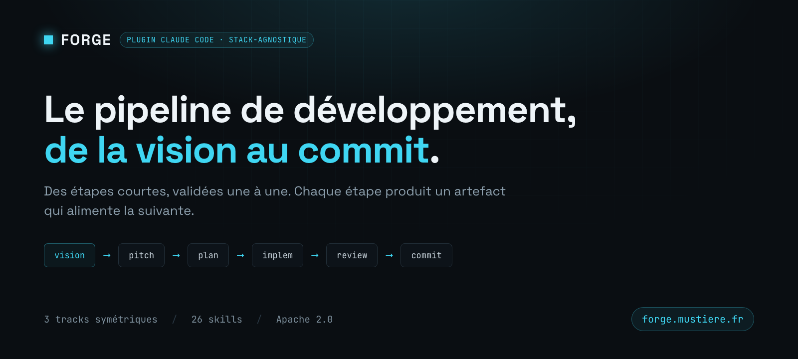

**Forge** est une marketplace de plugins Claude Code. Elle publie un plugin : `forge`, un pipeline de développement stack-agnostique qui pilote tout le cycle — de la vision projet jusqu'au commit — en étapes courtes, validées une à une.

**📖 Documentation complète : [forge.mustiere.fr](https://forge.mustiere.fr)** — pipeline, tracks, référence des skills, configuration et dépannage.

## Installation

Dans une session Claude Code, sur n'importe quel projet :

```
/plugin marketplace add gabrielmustiere/forge
/plugin install forge@forge
/reload-plugins
```

Les skills sont namespacées par le nom du plugin : `/forge:help`, `/forge:feature-pitch`, etc.

Mettre à jour : `/plugin marketplace update forge` puis `/reload-plugins`.

Une fois installé, `/forge:help` est le GPS du pipeline. La documentation détaillée vit sur [forge.mustiere.fr/docs](https://forge.mustiere.fr/docs/).

## Ce que contient ce dépôt

| Chemin | Rôle |
| --- | --- |
| `plugins/forge/` | Le plugin et ses skills — inventaire : [`SKILLS.md`](plugins/forge/SKILLS.md) |
| `.claude-plugin/marketplace.json` | Le catalogue de la marketplace |
| `site/` | Le site publié sur [forge.mustiere.fr](https://forge.mustiere.fr) (GitHub Pages) |

> Les skills Symfony, Sylius et éditoriales vivent dans une marketplace séparée : [`gabrielmustiere/skills`](https://github.com/gabrielmustiere/skills).

Pour tester une modification du plugin avant publication : `claude --plugin-dir <chemin>/plugins/forge`, puis `/reload-plugins` après chaque modification.

## Projet lié

**[Forge Board](https://github.com/gabrielmustiere/forge-board)** — application Symfony qui projette les stories produites par ce workflow (`docs/story/`) en kanban. Développée jusqu'au 30 juillet 2026 dans ce dépôt, puis extraite dans le sien.

## Licence

Distribué sous licence [Apache 2.0](LICENSE). © 2026 Gabriel Mustiere.
